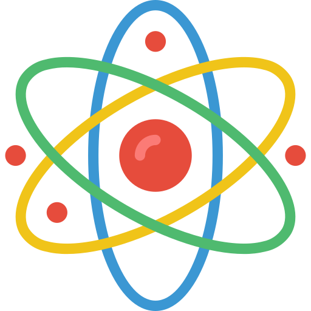

## Hi, I'm Leonardo 💻

I’m a programmer always open to new challenges and to know more. I am passionate about different areas of technology such as blockchain technology  , Quantum physics/computing , cryptography  and the development of optimisation algorithms , but also the financial sector  especially when it comes to cryptocurrencies and investments  . 
I love meeting and interacting with new people to discuss and exchange ideas on current innovations.

### Social

  

